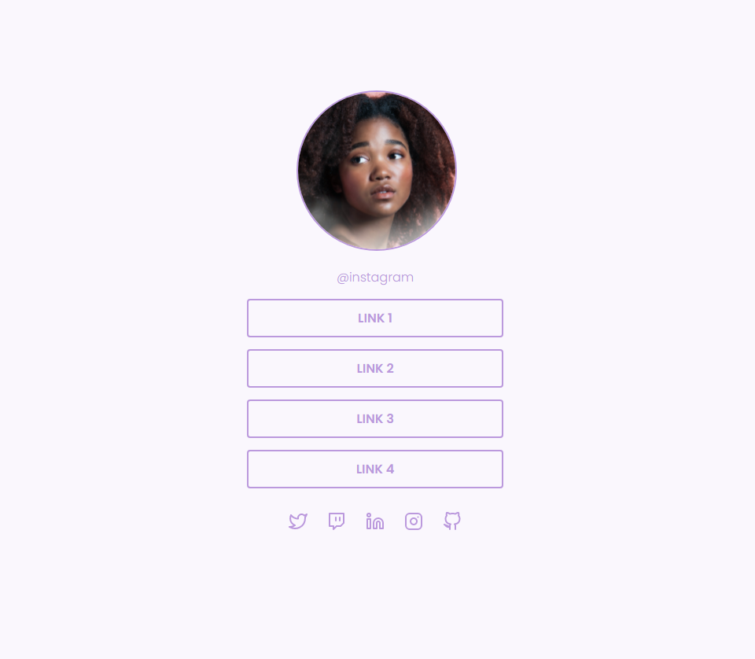

# Socialtree

  

##

### 🛠 Tecnologias
Foram usadas as tecnologias:

  - *HTML*
  - *CSS*

##

### 💻 Projeto
Neste desafio foi criado uma página com uma lista de links (menu) que pode ser usada em perfis de redes sociais para direcionar o usuário para o local escolhido. Utilizando HTML e CSS.

Figma: https://www.figma.com/file/5sxkg1xQMu6DKp95rdNvsj/DD-%2F-Social-links-(Copy)?node-id=0%3A1

#### Features:
<!-- ❌✅ -->

1. ✅ Adicionar uma imagem de perfil.
2. ✅ Adicionar uma lista de links que pode ser usada para enviar o usuário para outros sites.
3. ✅ Adicionar ícones com links para outras redes sociais.

##

### 🚀 Deploy
https://rafaeljurkfitz.github.io/socialtree/
